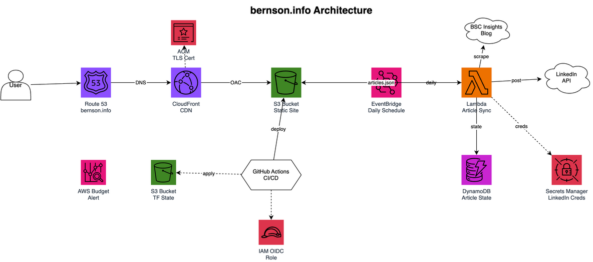

# bernson.info

Static Next.js site hosted on AWS (S3 + CloudFront + Route53), with GitHub Actions CI/CD for Terraform and site deploys.

## Structure

```
todd-site-next/          Next.js static export (bernson.info)
terraform/               AWS infrastructure (flat layout)
  lambda/                LinkedIn article sync Lambda source
.github/workflows/       CI/CD pipelines
```

## Development

```bash
cd todd-site-next
npm install
npm run dev              # http://localhost:3001
```

## Terraform

Infrastructure is applied via GitHub Actions on changes under `terraform/`. For local use:

```bash
cd terraform
terraform init
terraform plan
terraform apply
```

## GitHub Actions

| Workflow | Trigger | Action |
|----------|---------|--------|
| `terraform.yml` | `terraform/**` changes | `validate`, `plan`; `apply` on `main` |
| `deploy-site.yml` | `todd-site-next/**` changes on `main` | Build, S3 sync, CloudFront invalidation |

### Required repo settings

After `terraform apply`, copy outputs into repo **Settings > Secrets and variables > Actions**:

| Setting | Type | Command |
|---------|------|---------|
| `AWS_ROLE_ARN` | Secret | `terraform output -raw gha_secret_aws_role_arn` |
| `AWS_REGION` | Variable | `terraform output -raw gha_var_aws_region` |
| `TF_VERSION` | Variable | Set manually (e.g. `1.15.3`) |
| `S3_BUCKET` | Variable | `terraform output -raw gha_var_s3_bucket` |
| `CLOUDFRONT_DISTRIBUTION_ID` | Variable | `terraform output -raw gha_var_cloudfront_distribution_id` |

## Architecture


